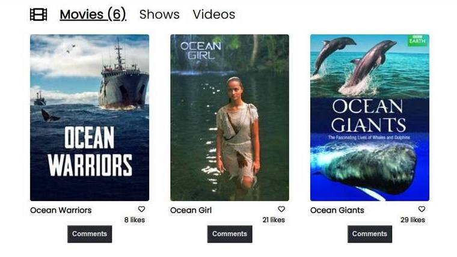

# Capstone JS Movie app

> Microverse project on practcing gitflow, webpack, Javascript, consuming API's,



Additional description about the project and its features.

## Built With

- HTML
- CSS
- JAVASCRIPT
- Node.js/NPM


## Getting Started

Clone the repository from [here](https://github.com/Nuri1977/capstone-js-movies.git)

```
npm install
npm run build
npm start
```
<br>

## Interaction with the API's

This app is consuming 2 API's :
  1. The TV MAZE (https://www.tvmaze.com/api) and the instructions are on their website.
  2. The Involnment API (https://us-central1-involvement-api.cloudfunctions.net/capstoneApi/) and you can see the instrunctions in this [link](https://www.notion.so/Involvement-API-869e60b5ad104603aa6db59e08150270).


  <br>

## Authors

👤 **Angel Orozco**

- GitHub: [@orozCoding](https://github.com/orozCoding)
- LinkedIn: [LinkedIn](https://www.linkedin.com/in/angel-orozco-652230228/)
- Twitter: [@orozCoding](https://twitter.com/orozcoding)

👤 **Nuri Lacka**

- GitHub: [@Nuri1977](https://github.com/Nuri1977)
- Twitter: [@Lackanuri](https://twitter.com/LackaNuri)
- LinkedIn: [@nurilacka](https://www.linkedin.com/in/nuri-lacka-7141b01ba/)


## 🤝 Contributing

Contributions, issues, and feature requests are welcome!

Feel free to check the [issues page](../../issues/).

## Show your support

Give a ⭐️ if you like this project!

## Acknowledgments

- [Microverse Inc](https://www.microverse.org/)

## 📝 License

This project is [MIT](./MIT.md) licensed.